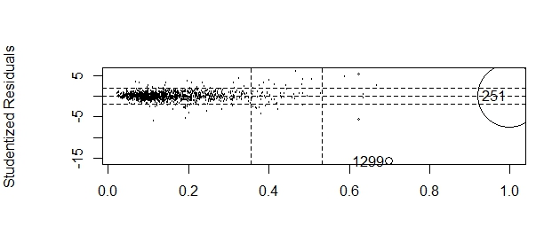
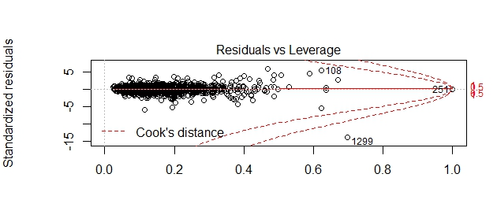

Slides
========================================================
author: Black Flamingos
date: November 2017
autosize: false

Cleaning/Imputing
========================================================

- Straight mode imputing for most 
- Other-column-dependent mode imputing otherwise



Releveling 
========================================================
(Linear only)

Goal: Improve predictions for "average" houses at the expense of predictions for "rare" houses

Inspecting a categorical feature with rare levels (<1% of data):


```
# A tibble: 6 x 2
  Heating `n()`
   <fctr> <int>
1   Floor     1
2    GasA  1428
3    GasW    18
4    Grav     7
5    OthW     2
6    Wall     4
```

Solution:

```r
levels(houses.train$Heating)[levels(houses.train$Heating) %in% 
                               c("Floor", "Grav", "OthW", "Wall")] <- "Other"
```


```
# A tibble: 3 x 2
  Heating `n()`
   <fctr> <int>
1   Other    14
2    GasA  1428
3    GasW    18
```


Feature Engineering
========================================================

- Garage interaction: GarageQual * GarageCars
- Total bathrooms: FullBath + HalfBath + BsmtFullBath + BsmtHalfBath
- Average room size: GrLivArea / TotRmsAbvGrd
- Bathroom to room ratio: (FullBath + HalfBath) / BedroomAbvGr
- Comparative size of living area: GrLivArea / mean(GrLivArea)
- Landscape-ability interaction: LotShape, LotContour


Splitting and Encoding
========================================================

- Split Kaggle train data into 'private train' and 'private test' (80/20)
- Encoding: Label-count encoding for tree models; one-hot encoding for linear, ridge/lasso, elastic net

Modeling Process (individual models)
========================================================

- Grid search to tune hyper parameters (if applicable)
- Fit model to private train set with tuned parameters
- Predict on private test set; if okay, proceed...

- Fit new model to Kaggle train set with private train hyperparameters
- Cross-validate on Kaggle train set; if okay, proceed...

- Predict on Kaggle test set
- Submit to Kaggle; deal with feelings of mediocrity


Models Trained
========================================================
(In R and Python)

- Multiple linear, spline
- Ridge, LASSO, elastic net
- Decision tree (basic)
- Random Forest
- Gradient boosted forest
- XGBoosted forest


Stacking
========================================================

Following Zeyu:

- 1 Spline 
- 1 XGBoost

Meta model: GBM

KAGGLE
========================================================
